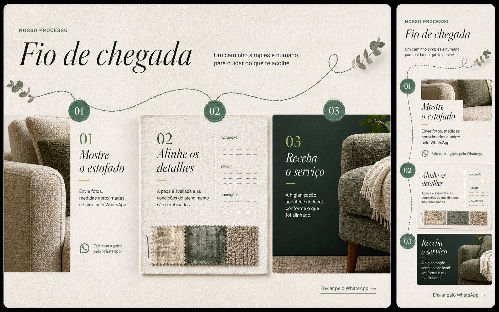
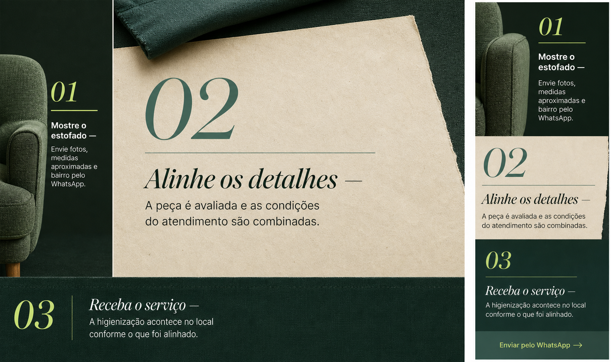
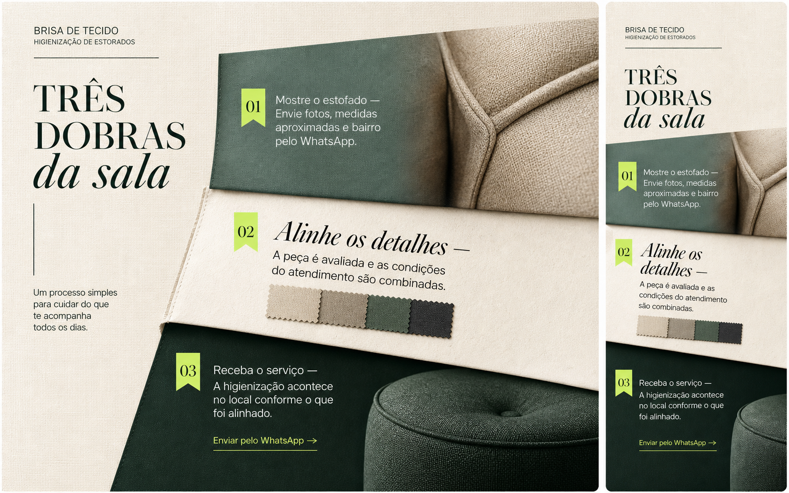

# B-02 — Como funciona — direções visuais A/B/C

> Exploração visual para escolha. Nenhuma direção abaixo foi implementada. A hero B-01R1 A.2, barra integrada, cabeçalho e B-01R2 A — Ateliê de tramas permanecem congelados.

## Conteúdo invariável

1. **01 — Mostre o estofado**  
   Envie fotos, medidas aproximadas e bairro pelo WhatsApp.
2. **02 — Alinhe os detalhes**  
   A peça é avaliada e as condições do atendimento são combinadas.
3. **03 — Receba o serviço**  
   A higienização acontece no local conforme o que foi alinhado.

O único convite contextual permitido vem depois do passo 03: **Enviar pelo WhatsApp →**. Ele é uma saída discreta, sem competir com o CTA da hero.

## A — Fio de chegada

**Estrutura.** Um fio de costura eucalipto atravessa os três momentos em uma única superfície de papel. O primeiro passo é uma matéria fotográfica vertical; o segundo, uma ficha de avaliação em papel com amostras têxteis; o terceiro, uma placa verde profunda de chegada. No desktop, a leitura progride em três estações na horizontal; no mobile, o fio vira eixo vertical entre os três blocos.

**Matéria.** Pode reutilizar os recortes reais de estofado já existentes; a amostra têxtil é um asset gráfico novo a criar somente se esta direção for escolhida. A prancha usa folhagem como referência de atmosfera, mas ela não faz parte da direção proposta para implementação.

**Motion.** A linha se desenha uma vez no reveal, com cada estação assentando logo depois. Ao passar o cursor, apenas a estação correspondente eleva a textura e encurta o fio até ela. Na rolagem, não há sticky nem troca de estado; em movimento reduzido, linha e três passos já aparecem completos e estáticos.

## B — Mesa de alinhamento

**Estrutura.** Uma composição de bancada: o passo 02 domina uma grande folha central, enquanto 01 entra como trilho vertical de chegada e 03 encerra a base em uma faixa escura. No desktop, a hierarquia valoriza o momento de avaliação sem ocultar a sequência. No mobile, cada parte desce como uma tira editorial contínua: chegada, ficha, fechamento.

**Matéria.** Fotos reais de braço/cadeira podem ocupar 01 e 03. Papel de fibra, regra de medida e pequena faixa de tecido são assets gráficos novos, a criar depois da escolha. A régua e o selo mostrados na prancha são intenção de matéria; não introduzem medição técnica, certificação ou promessa e podem ser removidos se não forem necessários ao alvo final.

**Motion.** O bloco 02 chega por uma expansão curta de escala enquanto 01 e 03 revelam pelas bordas. As linhas ácido apenas acompanham foco/teclado, sem transformar a seção em formulário. O scroll faz um reveal único; movimento reduzido mantém os três blocos inteiros, sem escala ou deslocamento.

## C — Três dobras da sala

**Estrutura.** Três folhas de papel e tecido se sobrepõem como dobras físicas: 01 começa numa faixa eucalipto com costura aparente, 02 abre a maior superfície clara para o alinhamento e 03 fecha num campo verde profundo. No desktop, o conjunto desce em diagonal; no mobile, as folhas se empilham com sobreposição controlada e mantêm os três passos plenamente legíveis, sem seleção ou carrossel.

**Matéria.** Reutiliza os três recortes reais de estofado da Brisa. As bordas de papel e pequenos retalhos são efeitos/ativos novos a criar depois da escolha, sem uso de imagem de cliente ou referência externa.

**Motion.** Cada dobra entra como uma folha que se assenta, em cascata breve 01 → 02 → 03. Hover/foco só levanta 2 px a dobra correspondente e intensifica sua linha de borda. No scroll, o conjunto revela uma vez; em movimento reduzido, não há sobreposição animada nem deslocamento.

## Recomendação

**C — Três dobras da sala.** É a continuação mais direta da energia material de B-01R2: deixa o tecido visível, dá a cada etapa uma função espacial própria e resolve mobile como leitura tátil em fluxo. Diferencia-se do seletor congelado porque não pede escolha nem muda conteúdo; a seção vira uma sequência tranquila de entendimento e chegada.

## Gate

Esperar a escolha explícita de Kevin: **A, B ou C**. Só então criar o brief de fidelidade B-02, inventariar os elementos finais e implementar exclusivamente `#como-funciona`.
