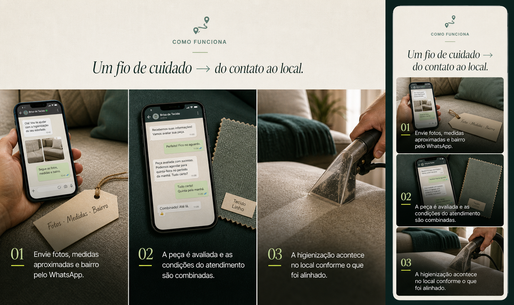
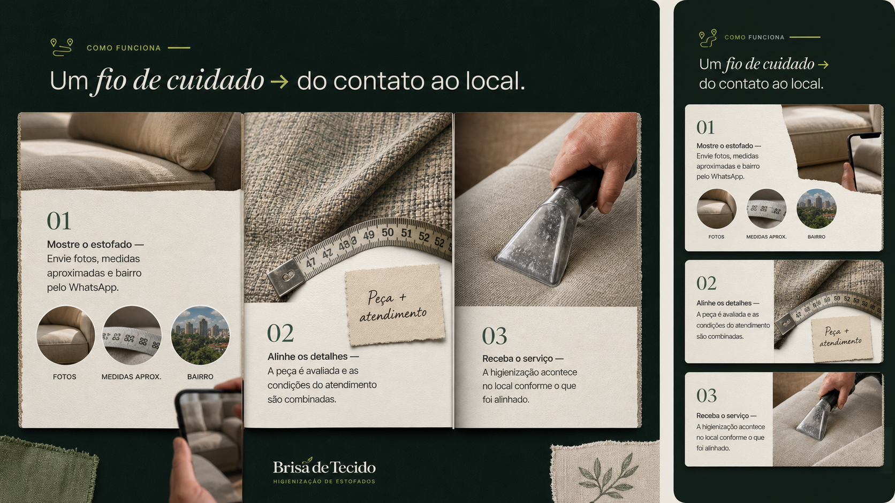
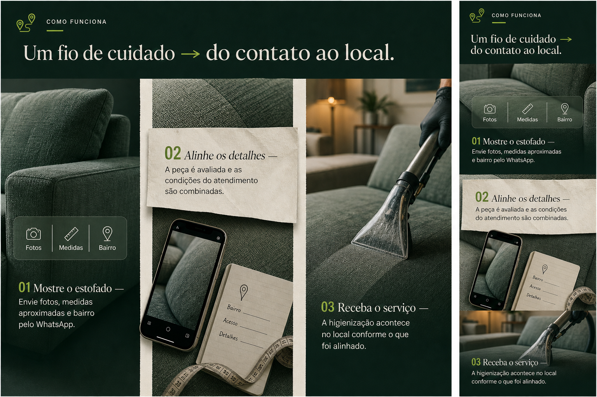

# B-02R1 — Como funciona — reexploração dos três passos

> B-02 A — Fio de chegada **não foi aprovada**. Esta rodada reabre apenas a história visual das três etapas. Cabeçalho com ícone, rótulo “Como funciona” e linha curta é uma restrição mantida; a linha longa superior e o fio pontilhado entre os cards são rejeitados e não devem voltar.

## Conteúdo invariável

1. **01 Mostre o estofado** — Envie fotos, medidas aproximadas e bairro pelo WhatsApp.
2. **02 Alinhe os detalhes** — A peça é avaliada e as condições do atendimento são combinadas.
3. **03 Receba o serviço** — A higienização acontece no local conforme o que foi alinhado.

O título segue em uma linha conceitual, sem quebra por frase: **Um fio de cuidado → do contato ao local.** O símbolo `→` é conexão editorial, não um CTA ou uma linha pontilhada.

## A — Rastro do cuidado

Três telas fotográficas de leitura imediata: foto preparada no telefone junto ao sofá; conversa de alinhamento; higienização em curso. A vantagem é a narrativa mais direta. Para uma implementação honesta, o segundo quadro não deve criar mensagens de WhatsApp específicas: a foto pode virar um enquadramento neutro do telefone e do tecido, sem inventar conteúdo de atendimento.

**Assets:** 01 pode usar sofá existente e um novo still/prop de telefone; 02 exige still neutro novo; 03 pode extrair um quadro do vídeo real existente após a escolha.

## B — Caderno de percurso

Três páginas materiais, sem retângulo sobre fotografia: 01 é uma folha de contato que transforma fotos, medidas e bairro em sinais grandes; 02 é uma página de avaliação, com trama e fita de medida como matéria; 03 mostra diretamente a higienização no tecido. Cada passo muda de assunto e de imagem, mas os três pertencem ao mesmo caderno de papel e linho.

**Assets:** 01 pode reutilizar foto de sofá e requer montagem gráfica nova; 02 precisa de foto/recorte de fita de medida novo ou produzido após a escolha; 03 pode extrair um quadro do vídeo real existente. Nenhuma imagem representa cliente, preço, prazo ou promessa.

## C — Da sua sala ao cuidado

Uma única faixa editorial de três janelas grandes, sem cards internos: 01 integra os três itens de primeiro contato sobre o sofá; 02 trata a própria foto do tecido como objeto de avaliação; 03 abre a cena da higienização no local. A seta do título conduz a sequência sem criar uma linha entre as imagens.

**Assets:** 01 reutiliza sofá existente; 02 pede novo still neutro de tecido/telefone; 03 usa frame do vídeo real depois da escolha. A prancha é intenção de composição, não fonte para copiar textos de tela ou detalhes de interface inexistentes.

## Recomendação

**B — Caderno de percurso.** É o mais claro para resolver a crítica central: cada imagem explica exatamente o passo em que está, o 02 ganha uma razão visual concreta e o conjunto continua tátil sem virar uma repetição dos painéis de B-01R2.

## Gate

Esperar uma escolha explícita de Kevin entre **A, B ou C** para esta reexploração. Não implementar, não alterar a hero, B-01R2 ou dobras posteriores antes dessa escolha.
