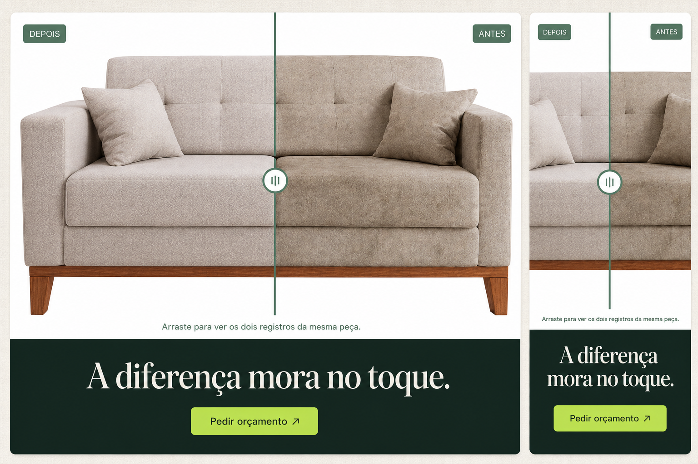
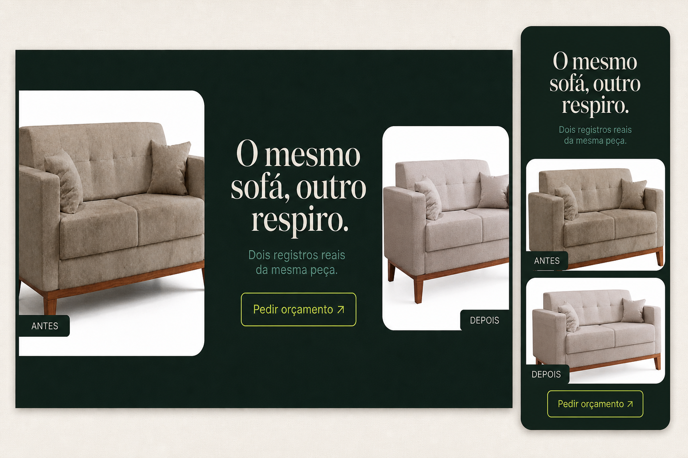
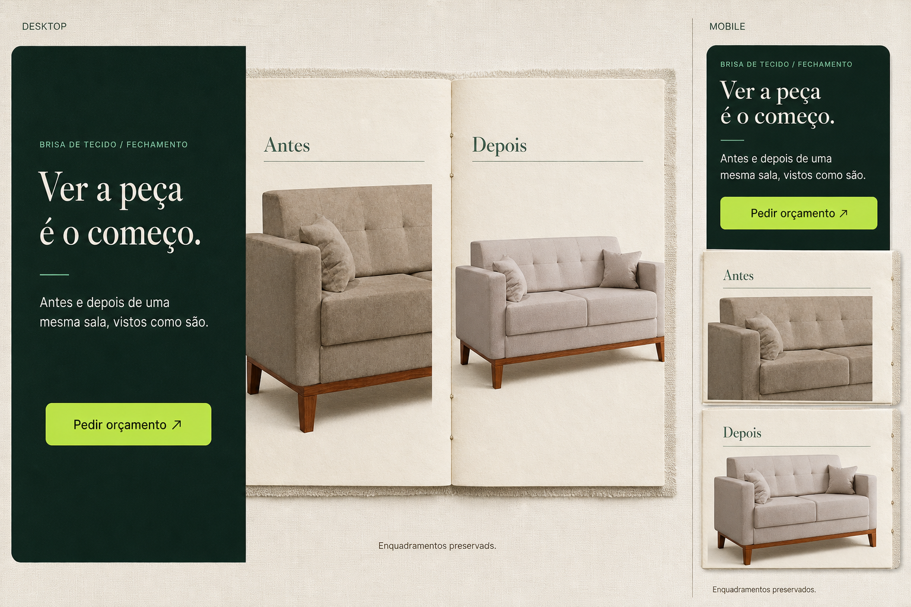

# B-03 — Fechamento final: direções A/B/C

Exploração visual do último bloco atual da Brisa, depois de `#duvidas`. Não é
implementação e não reabre B-01R1, B-01R2 ou B-02R1.

## Inventário honesto dos registros

- `brisa-before-sofa.png`: 1620 × 971 px, proporção 1,6684; enquadramento
  mais fechado, com o sofá ocupando mais o quadro.
- `brisa-after-sofa.jpg`: 833 × 499 px, proporção 1,6693; enquadramento mais
  aberto e com posição/escala diferentes.
- Ambos têm fundo branco e mostram a mesma peça. A proporção é compatível, mas
  não há alinhamento óptico confiável para um divisor que prometa a mesma
  coordenada da imagem.

## Diagnóstico de direção

O olhar deve primeiro encontrar a prova fotográfica, depois uma frase curta de
fechamento e por último a saída única para WhatsApp. A diferença de crop é uma
propriedade do registro: as direções abaixo a assumem em vez de escondê-la.
O movimento deve responder à leitura, não produzir uma segunda hero. O perfil
proposto é `restrained`.

## A — A diferença mora no toque (revisada)

Um único palco fotográfico toma quase toda a dobra: os registros Antes e Depois
ficam sobrepostos e o controle vertical eucalipto é arrastável. Ao levá-lo à
direita, revela-se mais do registro sujo; à esquerda, mais do registro limpo.
A faixa verde profunda fecha a leitura e contém a única saída. Depois da escolha,
a camada limpa foi normalizada por CSS, sem editar nem substituir os arquivos
fotográficos originais.

**Motion proposto:** o palco entra já no estado central; mouse, touch e teclado
movem o mesmo divisor, com rótulos Antes/Depois sempre visíveis. No scroll, a
faixa final assenta sem novo efeito de cena; em redução de movimento, os dois
estados permanecem disponíveis por controles de teclado, sem interpolação.

## B — Janela de contraste

O fechamento é um único campo verde profundo com duas janelas de proporções
diferentes. Elas tornam a assimetria dos registros uma decisão editorial e
deixam a frase atuar como centro entre o antes e o depois. É a alternativa de
maior contraste e presença no fim da página.

**Motion proposto:** a janela Antes revela primeiro e a Depois vem em seguida
com um deslocamento de 12 px; teclado e touch não exigem gesto, pois ambos os
estados são sempre visíveis. No scroll, a frase entra uma vez; em redução de
movimento, não há revelação nem deslocamento.

## C — Leitura tátil

Uma coluna de convite verde profundo contracena com um dossiê aberto em
papel/linho. Antes e depois ficam em páginas próprias, com legenda e borda
funcionais: a diferença de crop ganha contexto de registro, sem fingir um
comparador perfeito. É a alternativa mais autoral e mais coerente com a
matéria têxtil já aprovada.

**Motion proposto:** no primeiro encontro com a dobra, a capa verde assenta e
as duas páginas abrem 3° até o estado final; mouse, touch e teclado mostram
sempre as duas fotos — nenhuma interação é obrigatória. O scroll não prende a
seção; em redução de movimento, o dossiê já nasce aberto e sem transição.

## Crítica visual interna

As pranchas foram inspecionadas depois da geração. A primeira A foi
explicitamente corrigida: duas fotos lado a lado não comunicavam o comparador
pedido. A revisão usa um único palco e uma régua vertical com pega central,
sem setas, ornamentos ou painéis paralelos. B evita linhas editoriais sem
função; C usa as bordas do dossiê apenas para separar documentos fotográficos.
Nenhuma direção cria promessa, métrica ou segunda conversão.

## Recomendação

**A revisada — A diferença mora no toque.** A direção agora traduz exatamente
o gesto pedido: uma só foto em camadas, com o divisor arrastável revelando o
sujo à direita e o limpo à esquerda. Ela é o encerramento mais claro e direto.
