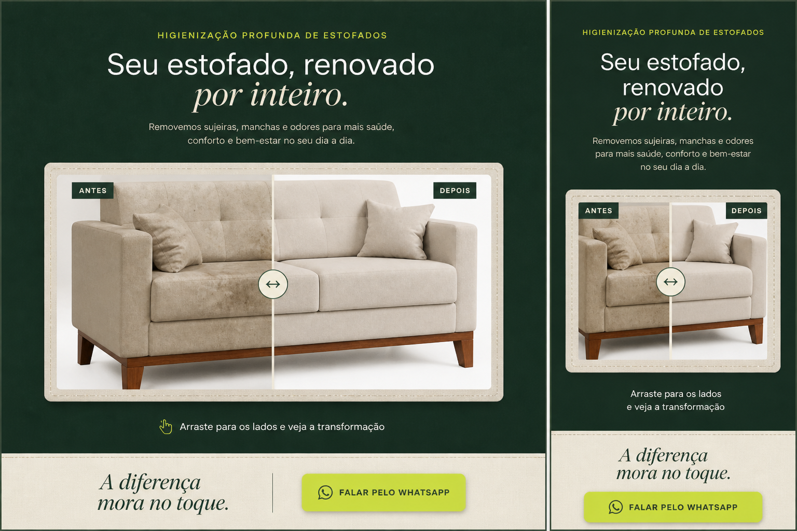

# B-03R1 A — Moldura de ateliê

Estado: direção A escolhida explicitamente por Kevin em 2026-09-01 e implementada localmente para revisão visual.

## Função

Fechar a experiência com uma prova visual clara do antes/depois, mantendo o comparador arrastável real e reduzindo a sensação de imagem solta ocupando a viewport inteira.

## Composição

- fundo verde profundo da Brisa;
- nome da dobra em verde ácido com linha funcional;
- título “Seu estofado, renovado por inteiro.”;
- moldura clara de papel/linho com contorno pontilhado de costura;
- fotos reais existentes do sofá, sobrepostas no mesmo comparador;
- rótulos “Antes · sem Brisa” e “Depois · Brisa de Tecido”;
- convite “Arraste para os lados e veja a transformação.”;
- fechamento “A diferença mora no toque.” e uma única saída para WhatsApp.

## Motion e acessibilidade

O arraste, touch, setas, Home e End continuam operando o mesmo slider. A moldura é estática; a resposta de movimento fica concentrada no divisor e na troca das camadas. Em `prefers-reduced-motion`, o comparador permanece operável sem transições.

Asset visual: usa somente `brisa-before-sofa.png` e `brisa-after-sofa-v2.png`, já existentes no projeto. A imagem desta prancha é referência de direção, não asset consumido pela aplicação.
